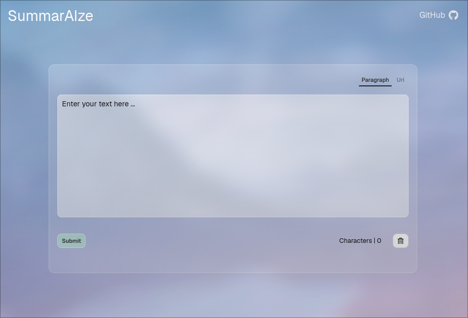
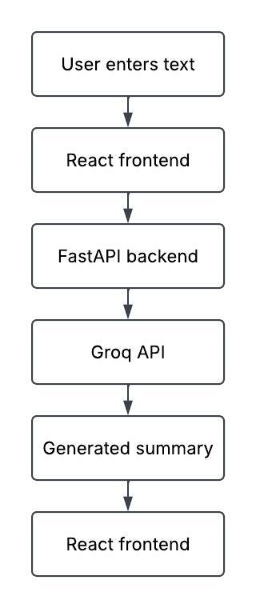

# Summarai


Summarai is an AI text summarization tool used to condense large bodies of text into three sentences.

## Features
- AI-Powered text summarization
- Copy the generated summary directly to your clipboard

## Tech Stack
[](https://react.dev/)

[](https://fastapi.tiangolo.com/)

[](https://vite.dev/)

[](https://www.docker.com/)

[](https://docs.docker.com/compose/)

[](https://github.com/features/actions)

[](https://pytest.org/)

[](https://vitest.dev/)

## Getting Started

### Using Docker (Recommended)
The quickest way to run Summarai is with Docker Compose

#### Prerequisites
- Docker
- Docker Compose
- A Groq API key

#### Installation
1. Get a Groq API Key from the [Groq Console](https://console.groq.com)
2. Clone the repository
3. Move into the repository directory

    ```cd summarai ```
4. Copy the contents of ```.env.example``` to a file called ```.env```

    - Windows

        ```Copy-Item backend/.env.example backend/.env```

    - Linux

        ```cp backend/.env.example backend/.env ```

5. Open the ```.env``` file in a text editor

    - Windows

        ```Notepad backend/.env```
    
    - Linux

        ```nano backend/.env```

6. Paste your Groq API key into the ```GROQ_API_KEY``` field, then save the ```.env``` file

    - Example

        ```GROQ_API_KEY=123your456groq789api101112key```

7. Use Docker Compose to start running Summarai

    ```docker compose up -d --build```

8. Go to the following URL in your web browser

    [http://localhost:8080/](http://localhost:8080/)

### Running Locally
You can also run Summarai directly on your machine if you'd like

#### Prerequisites

- Node.js
- Python 3.12
- A Groq API Key


## How it Works
Summarai uses a React frontend, a FastAPI backend, and the Groq API to generate summaries in the form of three bullet point sentences. When a user submits text, the frontend sends it to the backend in a POST request. The backend then processes the request and send the user's text to Groq. The text is summarized using the OpenAI's GPT OSS 120B model and returns the summary back to the frontend and displayed to the user. 



## Project Structure
Summarai uses a de-coupled application architecture with the React frontend and FastAPI backend in their own dedicated folders. Both services contain their own Dockerfiles and set of automated tests. The project root has a Docker Compose file used to run the services together

```
.
├── web-frontend/
│   ├── src/
│   │   ├── api/
│   │   ├── assets/
│   │   ├── components/
│   │   └── App.jsx
│   ├── tests/
│   │   ├── components/
│   │   ├── App.test.jsx
│   │   └── setup.js
│   ├── Dockerfile
│   └── package.json
├── backend/
│   ├── src/
│   │   ├── controllers/
│   │   ├── routers/
│   │   ├── schemas/
│   │   ├── utils/
│   │   └── main.py
│   ├── tests/
│   │   ├── __init__.py
│   │   ├── test_routes.py
│   │   └── test_services.py
│   ├── .env.example
│   ├── requirements.txt
│   └── Dockerfile
├── .github/
│   └── workflows/
│       └── tests.yml
├── .gitignore
├── docker-compose.yml
└── README.md
```

## Testing
Summarai uses [Pytest](https://docs.pytest.org/en/stable/) for backend testing and [Vitest](https://vitest.dev/) for frontend testing.

Tests are also automatically ran through GitHub Actions when pull requests are opened, and again when changes are pushed to the repository.

